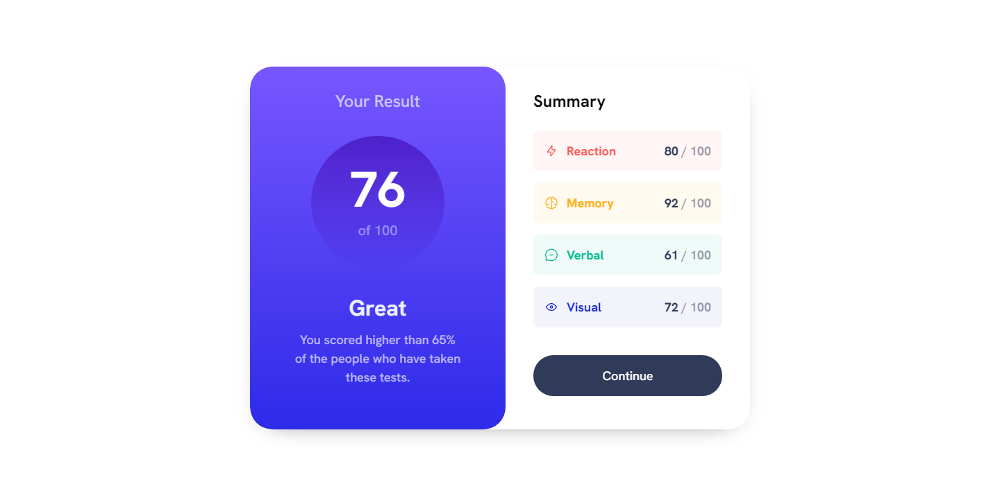

# Frontend Mentor - Results summary component solution

This is a solution to the [Results summary component challenge on Frontend Mentor](https://www.frontendmentor.io/challenges/results-summary-component-CE_K6s0maV). Frontend Mentor challenges help you improve your coding skills by building realistic projects. 

## Table of contents

- [Overview](#overview)
  - [The challenge](#the-challenge)
  - [Screenshot](#screenshot)
  - [Links](#links)
- [My process](#my-process)
  - [Built with](#built-with)
  - [What I learned](#what-i-learned)
  - [Continued development](#continued-development)
  - [Useful resources](#useful-resources)
- [Author](#author)

## Overview

### The challenge

Users should be able to:

- View the optimal layout for the interface depending on their device's screen size
- See hover and focus states for all interactive elements on the page

### Screenshot



### Links

- HTML solution URL: [HTML](https://github.com/JustANipple/results-summary-component/blob/master/index.html)
- CSS solution URL: [CSS](https://github.com/JustANipple/results-summary-component/blob/master/style.css)
- JS solution URL: [JS](https://github.com/JustANipple/results-summary-component/blob/master/script.js)
- Live Site URL: [Live site](https://justanipple.github.io/results-summary-component/)

## My process

### Built with

- Semantic HTML5 markup
- CSS custom properties
- Flexbox
- CSS Grid
- Mobile-first workflow
- JS dynamic scores
- Josh's Custom CSS Reset

### What I learned

Fetching the data.json was the hardest part, because i have not leared the asynchronous yet and was calling the Array created in the fetch outside of it, so it wasn't recognizing the variable
To avoid that, i managed to create the entire code and calling to outer functions inside the async fill function

To see how you can add code snippets, see below:

```js
async function fill() {

    const requestURL = "data.json";
    const request = new Request(requestURL);

    const response = await fetch(request);
    const datas = await response.json();

    populate(datas);
}
```

### Continued development

I need to learn how to use async/await for asynchronous code

### Useful resources

- [Working with JSON](https://developer.mozilla.org/en-US/docs/Learn/JavaScript/Objects/JSON) - I'm following the MDN guide to learn JavaScript and this helped a lot organizing my code

## Author

- Frontend Mentor - [@yourusername](https://www.frontendmentor.io/profile/JustANipple)
